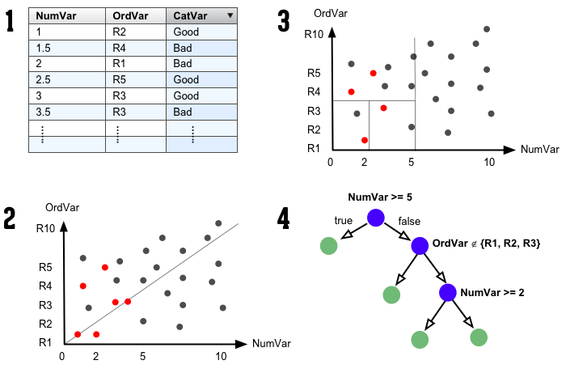

<iframe src="http://www.nytimes.com/imagepages/2008/04/16/us/20080416_OBAMA_GRAPHIC.html" width="70%" height="601"></iframe>

--- .largecontent
## 如何建構一棵樹?
### 將資料依照每一階段不同的條件作循環切割
- 定義亂度指標 (切割成兩塊時，亂度要大)
- 一次做一種切割 (一次長一個分支)
- 計算亂度分數，每次都挑讓分數變得最好的切割規則
- 當無法再切割時，停止
- 經典亂度指標：熵指標 ([entropy](https://en.wikipedia.org/wiki/Entropy_(information_theory), [Shannon](https://picasaweb.google.com/104430274632048494577/43014#6007917514467379730) 1949)

--- .largecontent
## 決策樹圖解

</img>

https://github.com/braz/DublinR-ML-treesandforests/

--- &vcenter .largecontent

## 練習

- 請完成 `08-RDataMining-03-Classification`
- 給進度超前朋友的小挑戰：[投票記錄資料](https://johnsonhsieh.github.io//DSC2016-R/example/R-Classification-primary.html)

--- .dark .segue
## 總結

--- &vcenter .largecontent
## 本課程結束之後，你該知道
- <h3 style="line-height:2em">DM的核心精神：機率、距離、風險、誤差</h3>
- <h3 style="line-height:2em">R語言是資料分析師的好幫手</h3>
- <h3 style="line-height:2em">資料探勘方法不是資料科學的全部</h3>
- <h3 style="line-height:2em">講師的聯絡方式：johnson@dsp.im</h3>

--- .dark .segue

## Text Mining

--- &vcenter .largecontent

## 文字資料範例：ptt 笨版文章

<pre><code>作者frank9712520 (YFChen)看板StupidClown標題[健忘] 手機不見了...(代PO)時間Wed Dec 23 02:29:15 2015
以下是朋友要求代PO的...

剛剛手上拿著手機在回人FB訊息回到一半，突然被我媽叫離開原本的位置，我媽找完我沒
事後就忘記手機放在哪裡了

用我媽的手機打過去，打通了，沒鈴聲，我關了靜音...

還很興奮地跑到電腦前要用Google Device 放鈴聲找，結果他要我輸入密碼

這兩個多月來當兵每次休假就叫我換密碼，在加上與世隔絕了36天，根本不記得密碼了，
按忘記密碼，可是經過一連串驗證他要寄認證信到我的備用信箱(yahoo的) 但是到我發完
文已經過了快一個小時還時沒收到信...
乾........................

距離上次變更密碼...54天前（因為帳號久未活動，所以要求更改密碼）
http://i.imgur.com/2u4GMKb.jpg

啊就是手機不見才要登入啊...結果現在又要傳訊息到手機
</code></pre>

--- &vcenter .largecontent

## 文字資料的特色

- 容易獲取、俯拾即是
- 非結構化、長短不一、沒有明顯規律
    - 挖掘規律是個挑戰
    - 由各種字彙組成
    - 常用的資料分析技術不容易套用在文字資料上
    - 整理資料的挑戰較高

--- &vcenter .largecontent

## 文字資料的結構化

- 找出方法將非結構化的文章轉變成結構化的資料
- 後續可針對各種應用問題，與其他ML或DM方法結合

--- &vcenter .largecontent

## 文字資料的清理

- 移除不必要的字元，如空白、標點符號
- 統一大小寫
- 斷詞
    - 英文資料使用空白做切割
    - 中文資料可以使用Open Source斷詞引擎搭配詞庫
        - [g0v 萌典](https://www.moedict.tw/about.html)

--- &vcenter .largecontent

## Term Document Matrix (TDM)

- 將文字資料在斷詞後，轉換為結構化資料的方式
- 以文章為單位
    - 每篇文章是一筆資料
- 將文章中包含的詞彙當成屬性
    - 運用大量布林屬性來標註文章中有沒有包含特定的詞彙

--- &vcenter .largecontent

## Feature Hashing

- 一種加速TDM處理效能的技巧
    - TDM 需要建立：  字彙 ==> 屬性位置 的對應表
    - Feature Hashing 運用Hashing Algorithm來做對應
- 喪失對屬性的解釋力
- </img>

--- &vcenter .largecontent

## 範例：Large Movie Review Dataset

- 50000 條關於電影的評論，來源： [IMDB](http://www.imdb.com)
- 一個電影最多不超過 30 reviews
- 將評論標記為「正面」與「負面」
    - 正負面是依據使用者的評分決定：分數小於等於4時是負面，其餘的是正面（滿分十分）
    - 50% 正面的評論，50% 負面的評論
- 這個資料可以自[Kaggle](https://www.kaggle.com/c/word2vec-nlp-tutorial)上下載

--- &vcenter .largecontent

## TDM

- </img>

--- &vcenter .largecontent

## Sentiment Analysis via R, FeatureHashing and XGBoost

- [文章網址](https://cran.r-project.org/web/packages/FeatureHashing/vignettes/SentimentAnalysis.html)
- 運用文章中介紹的技巧搭配Machine Learning套件，即可達到Benchmark的準確度

--- &vcenter .largecontent

## n-gram

- TDM 是標記字彙有無在文章之中
- n-gram 是將相鄰的n個字彙視為一個字彙

--- &vcenter .largecontent

## n-gram 範例

- `剛剛手上拿著手機在回人FB訊息回到一半，突然被我媽叫離開原本的位置，我媽找完我沒事後就忘記手機放在哪裡了`
- 斷詞：`剛剛  手上  拿  著  手機  在  回人  FB  訊息  回到  一半  突然  被  我媽  叫  離開  原本  的  位置  我媽  找  完  我  沒事  後  就  忘記  手機  放在  哪裡  了`
- TDM: 

| 剛剛| 手上| 拿| 著| 手機| 在| 回人| FB|
|----:|----:|--:|--:|----:|--:|----:|--:|
|    1|    1|  1|  1|    1|  1|    1|  1|

--- &vcenter .largecontent

## n-gram 範例

- 斷詞：`剛剛  手上  拿  著  手機  在  回人  FB  訊息  回到  一半  突然  被  我媽  叫  離開  原本  的  位置  我媽  找  完  我  沒事  後  就  忘記  手機  放在  哪裡  了`
- 2-gram： `剛剛+手上  手上+拿  拿+著  著+手機  手機+在  在+回人  回人+FB  FB+訊息  訊息+回到  回到+一半  一半+突然  突然+被  被+我媽  我媽+叫  叫+離開  離開+原本  原本+的  的+位置  位置+我媽  我媽+找  找+完  完+我  我+沒事  沒事+後  後+就  就+忘記  忘記+手機  手機+放在  放在+哪裡  哪裡+了`
- TDM: 

| 剛剛+手上| 手上+拿| 拿+著| 著+手機| 手機+在| 在+回人| 回人+FB| FB+訊息|
|---------:|-------:|-----:|-------:|-------:|-------:|-------:|-------:|
|         1|       1|     1|       1|       1|       1|       1|       1|

--- &vcenter .largecontent

## 練習

- 請完成 `X4-RDataMining-04-Text-Mining`

--- &vcenter .largecontent

## Q&A
